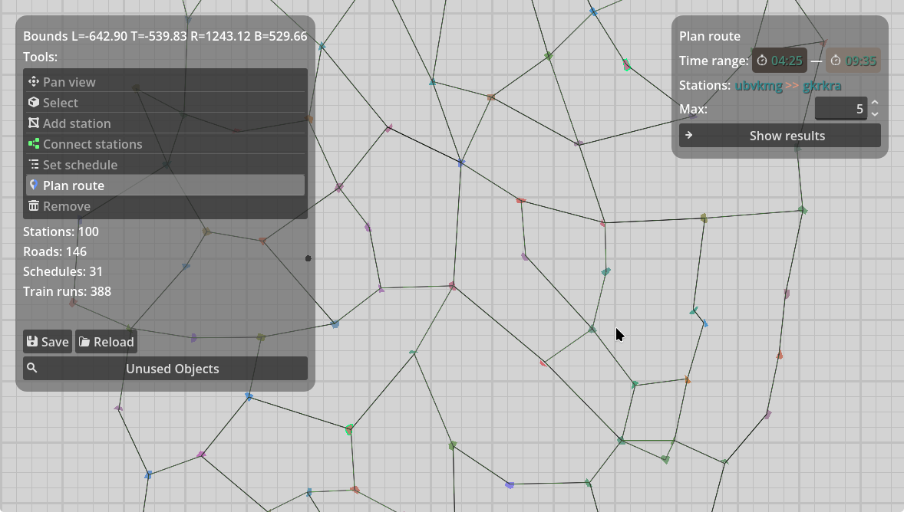
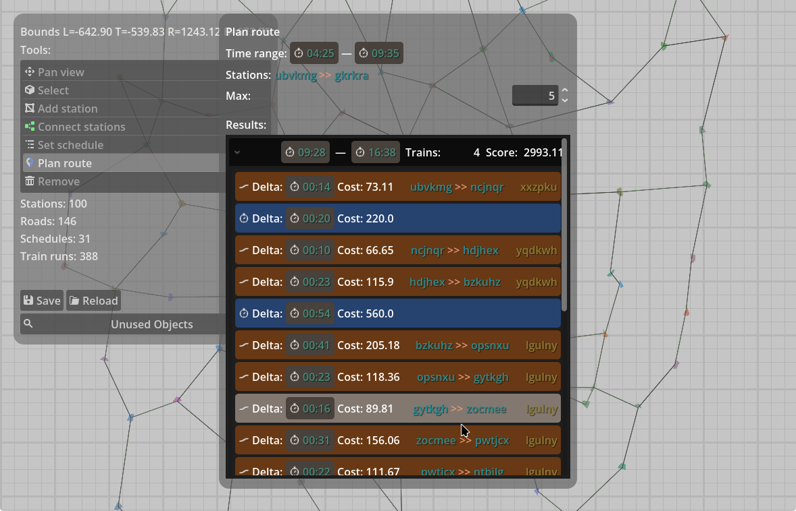
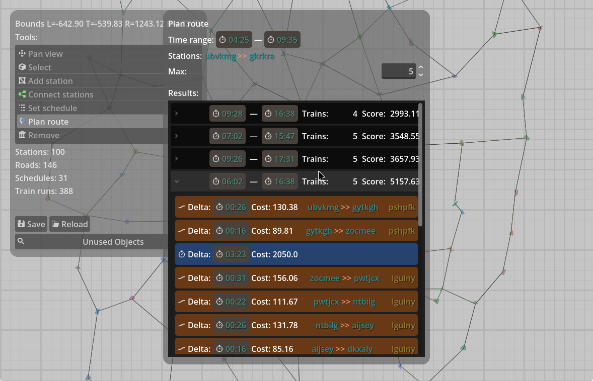
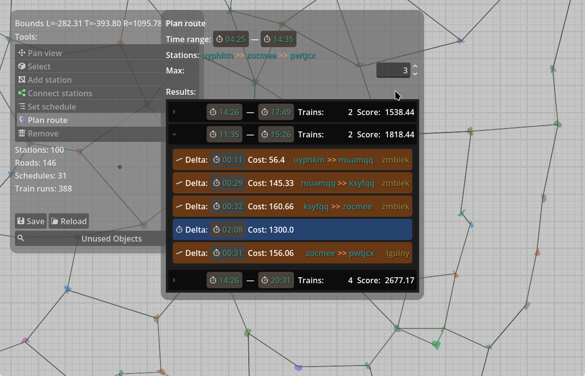
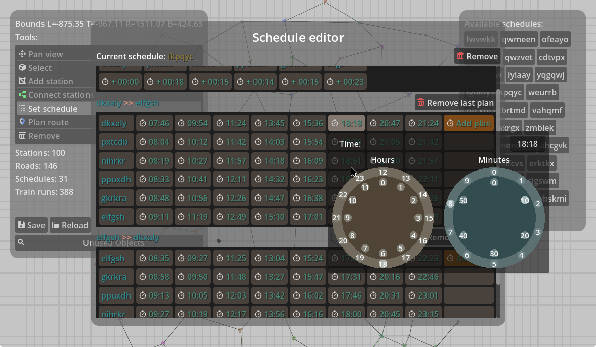
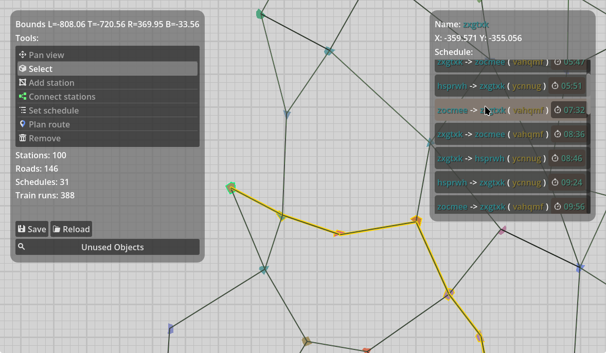

# Train route builder & planner
This project is used to create simulated train route plans to find best routes, using SWI-Prolog and Godot 4.

## Overview

You can use various tools in the left panel to move around, inspect/add/edit/remove objects, and to plan routes between
stations on the map. Panning by holding middle mouse button is enabled in all modes/tools.
You can use the default map provided, which is filled with stations, roads, and train plans, or you can create your own.
Delete the `db.pl` to start anew, and don't forget to make backups if you want to preserve the content.
Loading and saving map data is done through `db.pl`, while Prolog rules for retrieving more information and planning
routes are stored in `rules.db`. The latter file is not to be modified or moved/deleted.

To plan a route, select the _Plan route_ mode, then select two or more stations to choose a route.
You can also pick a time range to limit the boarding times of **the first** train only.
This does not affect further parts of the route.
Set the maximum number of returned routes, then press _Show results_.



Then, the view will pop up with computed routes shown in a list. Select an element to show the full path
with traversed stops and train switches. The score of each route shows how fit the route will be.
Lower score means better route.



You can expand other entries to explore alternative routes. The results are sorted from best to worst,
but **not** from earliest to latest.



You can select multiple stations in the query. The stations will be visited in order, without skipping any.




You can view and edit the schedule of each train line by selecting the _Set schedule_ tool, and selecting
one of available schedules. You can create new ones by making a path of stations connected by roads, then clicking
on an empty spot (a schedule consists of minimum 2 stations).



In _Select_ tool, when you select a station, a list of train stopping on this station will be shown on the right,
along with stop time. Clicking on an entry will open the editor for that schedule.



## Installation
First clone the repo:
```sh
$ git clone https://github.com/dekrain/prolog-trains.git --recurse-submodules
$ cd prolog-trains
```

Then, apply patches to the `Prologot` submodule:
```sh
$ cd Prologot
Prologot/ $ git apply ../Prologot.patch
```

While in the submodule directory, build the GDExtension for your version of Godot (replace `4.x` with your Godot version):
```sh
Prologot/ $ scons api_version=4.x
Prologot/ $ cd ..
```

After the build is complete, install the built GDExtension into the project.
You can simply remove the existing `bin` directory **in the root of the project**, and in its place copy over the `bin` from `Prologot` subdirectory:
```sh
$ rm -r bin
$ cp Prologot/bin .
```

or else, if you're on linux with SWI prolog ver. 10, you can use the provided symlinks to the build directory.

You can then open the project in Godot Editor, or run the project directly (this might require opening in the editor at least once to populate ID references).
